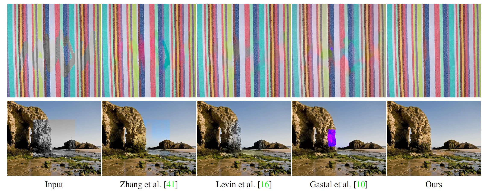
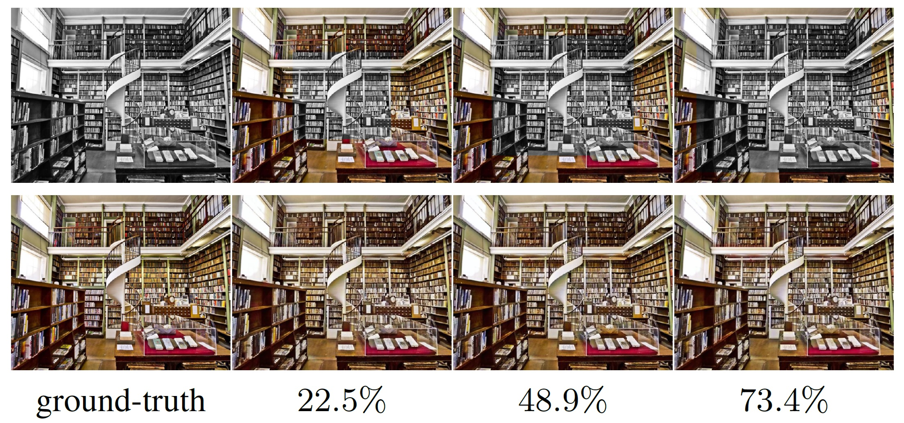

# Image Inpainting with External-internal Learning and Monochromic Bottleneck
This repository is for our CVPR 2021 paper: Image Inpainting with External-internal Learning and Monochromic Bottleneck

[paper](https://arxiv.org/abs/2104.09068) | [project website](https://tengfei-wang.github.io/EII/index.html )

## Introduction
The proposed method can be  applied to improve the color consistency of leaning-based image inpainting results.   The progressive internal color propagation  shows strong performance even with large mask ratios. 


## Prerequisites
- Python 3.6
- Pytorch 1.6
- Numpy

## Installation
```
git clone https://github.com/Tengfei-Wang/external-internal-inpainting.git
cd external-internal-inpainting
```

## Quick Start 
To try our internal colorization method:
```
python main.py  --img_path images/input2.png --gray_path images/gray2.png  --mask_path images/mask2.png  --pyramid_height 3
```
The colorization results are placed in ./results.

## Citation
If you find this work useful for your research, please cite:
```
@InProceedings{wang2021image,
     title={Image Inpainting with External-internal Learning and Monochromic Bottleneck}, 
     author={Tengfei Wang, Hao Ouyang and Qifeng Chen},
     booktitle = {IEEE/CVF Conference on Computer Vision and Pattern Recognition (CVPR)},
     year = {2021}
}             
```


## Contact
Please send emails to tengfeiwang12@gmail.com  if there is any question
